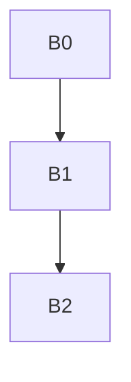

## 参考教程


[中南大学教程](https://www.bilibili.com/video/BV1q64y1Z7ZX?spm_id_from=333.337.search-card.all.click)







```cpp
B0:
int main()
{
    B1: //作用域 
    {
        B2://B2 作用域
        {
            
            B3:
            //B3 作用域
            {
                //B4 作用域
            }
        }

    }
    return 0;
}
```

要实现作用域的方式，我们可以 用一个堆栈


b0 是栈顶，b4 是栈顶

每次从栈顶 从上往下找， 找到变量就返回， 代码块结束后，就弹栈，变量作用域销毁


### 思考问题

符号表的插入删除 谁在做？

1. 编译程序运行时做？
2. 目标程序运行时做？
3. 程序员写编译程序时做？
4. 程序员写源程序时候做？


名字空间？


https://www.bilibili.com/video/BV1tv41177xo?spm_id_from=333.999.0.0


