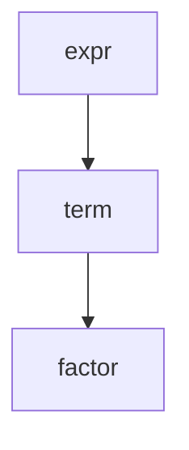
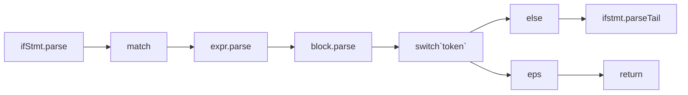
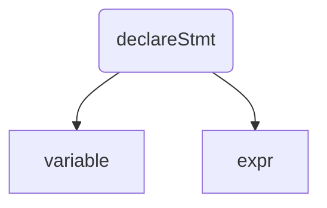
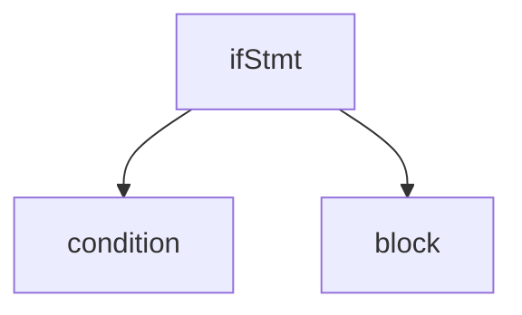

## ASTNode 实现


[参考课程1](https://www.bilibili.com/video/BV1EA411F7yU?spm_id_from=333.337.search-card.all.click)


[参考cnblog](https://www.cnblogs.com/dongkuo/p/9826410.html#%E8%AF%AD%E6%B3%95%E5%88%86%E6%9E%90)


```
unit   ->   factor+unit
          | factor-unit 
          | factor*unit 
          | factor/unit 
          | factor
factor -> VARIABLE | NUMBER


```


根据以上介绍，我们可以写出我们需要求值的表达式的产生式：

```
E  ->  E+T | E-T | T
T  ->  T*U | T/U | U
U  ->  -F | F
F  ->  (E) | FUNCTION(L) | VARIABLE  | NUMBER
L  ->  EL' | ε
L' ->  ,EL' | ε

```

E: expression, 表达式
T: term, 表达式项
U: unary, 一元式
F: factor, 表达式项的因子
L: expression list，表达式列表
ε：空


[斯坦福的编译原理课程](https://www.bilibili.com/video/BV1NE411376V?p=37)


[目前看到不错的解析视频](https://www.bilibili.com/video/BV1nv41117em?spm_id_from=333.999.0.0)


```
expr -> term( (plus|minus )term )* 
term -> factor ( ( mul | div ) factor )*
factor -> INT | FLOAT 
       -> (plus|minus) factor # -1,+2 ,--1,---1,


```

这个 文法是通过递归来实现的

我们可以把左边 的 expr, term ,factor 理解为一个函数，函数调用链，就是压栈顺序






然后处理完之后会弹栈， 从 factor -> term -> expr

也就是说 越下面的 函数优先级越高

我们知道 运算符的优先级是先乘除，后加减，例如 `1+2*5` ,因此 上面的符号 文法 把 + 和 - 放在了 `* / `前面


[参考leetcode题解1](https://leetcode.cn/problems/basic-calculator-ii/solution/c-ll1-di-gui-xia-jiang-biao-da-shi-qiu-zhi-han-gua/)


```cpp
#include <iostream>

using namespace std;

class Solution {
  private:
    char token;
    string buffer;
    int index;

    char peek() {
        // remove whitespaces
        while (buffer[index + 1] == ' ') ++index;
        return buffer[index + 1];
    }

    void consume() {
        ++index;
        token = buffer[index];
    }

    int expr() {
        // Expr -> Term Expr'
        int value = term();
        // Expr'-> +Term| -Term | eps
        while (1) {
            if (peek() == '+') {
                consume();
                value += term();
            } else if (peek() == '-') {
                consume();
                value -= term();
            } else {
                break;
            }
        }
        return value;
    }

    int term() {
        // Term -> Factor Term'
        int value = factor();
        // Term'-> *Factor Term' | /Factor Term' | eps
        while (1) {
            if (peek() == '*') {
                consume();
                value *= factor();
            } else if (peek() == '/') {
                consume();
                value /= factor();
            } else
                break;
        }
        return value;
    }

    // Factor -> (Expr) | NUM | -NUM
    int factor() {
        int sign = 1;
        if (peek() == '-') {
            consume();
            sign = -1;
        }

        int value;

        if (isdigit(peek())) {
            value = sign * number();
        } else if (peek() == '(') {
            consume(); // match (
            value = sign * expr();
            consume(); // match )
        }
        return value;
    }

    // NUM (unsigned)
    int number() {
        int value = 0;
        while (isdigit(peek())) {
            consume();
            value = value * 10 + (token - '0');
        }
        return value;
    }

  public:
    int calculate(const string &s) {
        buffer = s;
        index = -1;
        // entry
        return expr();
    }
};

int main() {
    Solution a;
    pair<string, int> test[] = {
        {"1 + -1", 0},
        {" -1 ", -1},
        {"1   + 1", 2},
        {"2 - 1 + 2", 3},
        {"(1+(4+5+2)-3)+(6+8)", 23},
        {"3+2 * 2", 7},
        {"((1 + (3 * 2 / 1) * 2) + 1) / (2 * 2 * 2 - 1)", 2}};
    for (auto &[s, t] : test) {
        cout << "`" << s << "`" << endl;
        cout << "Expected: " << t << ", Actual: " << a.calculate(s) << endl;
        cout << string(20, '-') << endl;
    }
    return 0;
}

 


```


[自上而下语法分析，编译原理课程2](https://www.bilibili.com/video/BV1TW411b7f3?p=19)


[国防科技大学](https://www.bilibili.com/video/BV12741147J3?p=12)


## 外国教程收集

[教程1](https://www.youtube.com/watch?v=70NVv0nVLlE)


[递归生成语法树2](https://www.youtube.com/watch?v=SToUyjAsaFk)


```

E -> E + T | E - T | T
T -> T * F | T / F | F
F -> ( E ) | NUM

```


https://www.youtube.com/watch?v=SToUyjAsaFk

有点乱，抄这个视频给的伪代码，感觉讲的不错

```python
parseE:
    a=parseT()
    while True:
        if self.token=='+':
            self.consume()
            b = parseT()
            a = new Add(a,b)
        elif self.token=='-':
            self.consume()
            b = parseT()
            a = new Add(a,b)
        else:
            break

parseT:
    a=parseF()
    while True:
        if self.token=='*':
            self.consume()
            b = parseF()
            a = new Mul(a,b)
        elif self.token=='/':
            self.consume()
            b = parseF()
            a = new Div(a,b)
        else:
            break
    return a
parseF:
    if self.token=='(':
        self.consume()
        a=parseE()
        self.consume()
        return a
    else:
        a=new Num(int(self.token))
        self.consume()
        return a
Num:
    def __init__(self,value):
        self.value=value
    def eval(self):
        return self.value


consume:
    self.token=self.buffer[self.index+1]
    self.index+=1
```

这个是按照上面给的 表达式写的代码

[leetcode 227解题代码](https://leetcode.cn/problems/basic-calculator-ii/)


```cpp
/*
 * @lc app=leetcode.cn id=227 lang=cpp
 * https://leetcode.cn/problems/basic-calculator-ii/
 * [227] 基本计算器 II
 */
// #include <iostream>

// using namespace std;

// @lc code=start

struct Node
{

    char type;
    Node *left;
    Node *right;
    long long val;
    Node(char t, Node *l, Node *r, long long v) : type(t), left(l), right(r), val(v){};
};

class Solution
{
public:
    int calculate(string s1)
    {
        s = s1;
        index = 0;

        Node *p = parseE();
        int res = eval(p);

        freeTree(p);
        return res;
    }

    string s;
    int index;
    int eval(Node *p)
    {
        if (p->type == '0')
        {
            return p->val;
        }

        if (p->type == '+')
        {
            return eval(p->left) + eval(p->right);
        }
        else if (p->type == '-')
        {
            return eval(p->left) - eval(p->right);
        }
        else if (p->type == '*')
            return eval(p->left) * eval(p->right);
        else if (p->type == '/')
            return eval(p->left) / eval(p->right);
        else
            return p->val;
    }

    void freeTree(Node *root)
    {
        if (!root)
        {
            return;
        }
        freeTree(root->left);
        freeTree(root->right);
        delete root;
    }

    int getNum()
    {
        trimSpace();
        int res = 0;
        while (index < s.size() && isdigit(s[index]))
        {
            res = res * 10 + ( s[index++] - '0');
        }
        return res;
    }

    Node *parseE()
    {

        Node *b = NULL;
        Node *a = parseT();
        while (index < s.size())
        {

            if (peek() == '+')
            {
                index++;
                b = parseT();
                a = new Node('+', a, b, 0);
            }
            else if (peek() == '-')
            {
                index++;
                b = parseT();
                a = new Node('-', a, b, 0);
            }
            else
            {
                break;
            }
        }
        return a;
    }

    Node *parseT()
    {
        Node *b = NULL;
        trimSpace();
        auto a = parseF();

        while (index < s.size())
        {
            if (peek() == '*')
            {
                index++;
                b = parseF();
                a = new Node('*', a, b, 0);
            }
            else if (peek() == '/')
            {
                index++;
                b = parseF();
                a = new Node('/', a, b, 0);
            }
            else
            {
                break;
            }
        }
        return a;
    }
    Node *parseF()
    {

        if (peek() == '(')
        {
            index++;
            Node *res = parseE();
            if (peek() == ')')
            {
                index++;
                return res;
            }
        }
        else if (isdigit(s[index]))
        {
            int val = getNum();
            return new Node('0', NULL, NULL, val);
        }
        return new Node('0', NULL, NULL, 0);
    }

    char peek()
    {
        trimSpace();
        return s[index];
    }
    void trimSpace()
    {
        while (index < s.size() && s[index] == ' ')
            index++;
    }
};
// @lc code=end

// int main(void)
// {
//     Solution s;
//     cout << s.calculate("1+1+1") << endl;
//     cout << "hello worldL" << endl;
// }


```


## 后缀表达式


| 中序 | 后序  |
| :--:| :--: |
| 2*(5+7) | 2 5 7  + *  |
| a == b^c | a b == ^c  |


##  ast语法解析

[参考视频](https://www.youtube.com/watch?v=9-EYWLbmiG0)


[参考项目1](https://github.com/andybalaam/cell/blob/master/pycell/parser.py)


```python
foo="bar"

{"symbol","foo"}
{"=" ,""}
{"string","bar"}
{";" ,""}

print(x+2);

{"symbol","print"}
{"(" ,""}
{"symbol","x"}
{"operator" ,"+"}
{"number","2"}
{")" ,""}
{";" ,""}

x=3+4;
assignment:
    symbol: x
    value:
        Operation:
            type: +
            arguments:
                3
                4

```


## 定义块和语句

```
program -> stmts -> stmt stmts | eps
stmts -> ifStmt | forStmt | whileStmt | Funciton  | block | eps
block -> {stmts}

```


### 变量定义

```
declearStmt ->  var variable = expr
# 形如： var  a = 1+1*2;
```



```mermaid
graph TB
declareStmt_parse --> match`var`
match`var` --> factor.parse -->match`=`
match`=`  --> expr.parse
```



### IFStmt

```
IfStmt -> If(Expr) Block |
          If(expr) Block Else Block |
          If(expr) Block else IfStmt

# 简化定义

IfStmt -> If(expr) block tail
tail -> else {block} | else IfStmt | eps
```







### Function Stmt

```
function->func (args) type block

args --> type variable,args|type variable|eps

returntype -->type|eps
type: int|string|void|bool|string 

```


### declare stmt伪代码

```python
var stmt=DeclareStmt
match("var")

factor=getNext()
if factor is None:
    raise SyntaxError("var stmt error")

stmt.addChild(factor)
token=match("=")
expr=getNext()
stmt.addChild(expr)

return stmt

```






## ifStmt 伪代码


```python
var t = match("if")
match("("))
expr = getNext()
match(")")
block = getNext()
ifStmt = IfStmt()
ifStmt.addChild(expr)
ifStmt.addChild(block)


```






