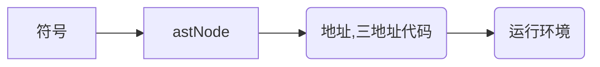

## 构造三地址代码

### 语法制导规则定义 (syntax directed definition)

- 定义抽象语法树如何被翻译
- 组成
  - 文法 （如何组织翻译程序？)
    - 属性 （用于存储结果和中间值）
    - 规则（描述属性如何被计算）


如何把脚本语言，例如 dsl 转换为 sql ?  我们需要 制作中间的翻译规则

####  四则运算的语法制导定义 （SDD）

E->E1+T => e.val = e1.val + t.val 
e->t   e.val = t.val

f->digit f.val = digit.lexval


#### 符号表问题


```js
var a=1
{
    var a = 10
    var b = a+1
}


```






- 符号
- 常量表
- 变量表


### 静态符号表
实现方式：
- 1.哈希表
- 2. 树和哈希表


## 查找符号（递归向上过程）

- symbolTable.find
  - symbolTable.parent.find
    - symbolTable.parent.parent.find
      - 递归。。。


### 上地址代码的表示


```js
var a = 1

// assign a 1
if (true) {

}else {

}

/*
if 

goto 
*/

```


### 三地址代码表示

```
var s = "a+(b-c) + d*(b-c)*2 "
; 将会转化为
p0=b-c
p1=b-c
p2=p1*2
p3=d*p2
p4=p0+p3
p5=a+p4

var b = 1.0*2.0*3.0;
; 
p0 = 2.0 * 3.0
p1 = 1.0 * p0
a = p1

```
 

### 符号表运行时

```
p0 --> sp+0
p1 --> sp+4
a --> sp+8
b --> sp+12

```
### 活动记录


```
int fact(int n) {
    if ( n==0 ) {
        return 1
    }
    return fact(n-1) * n
}


```


